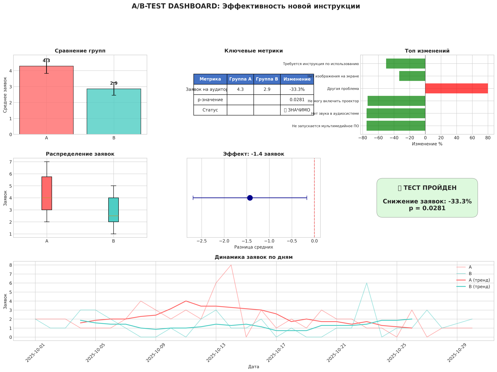
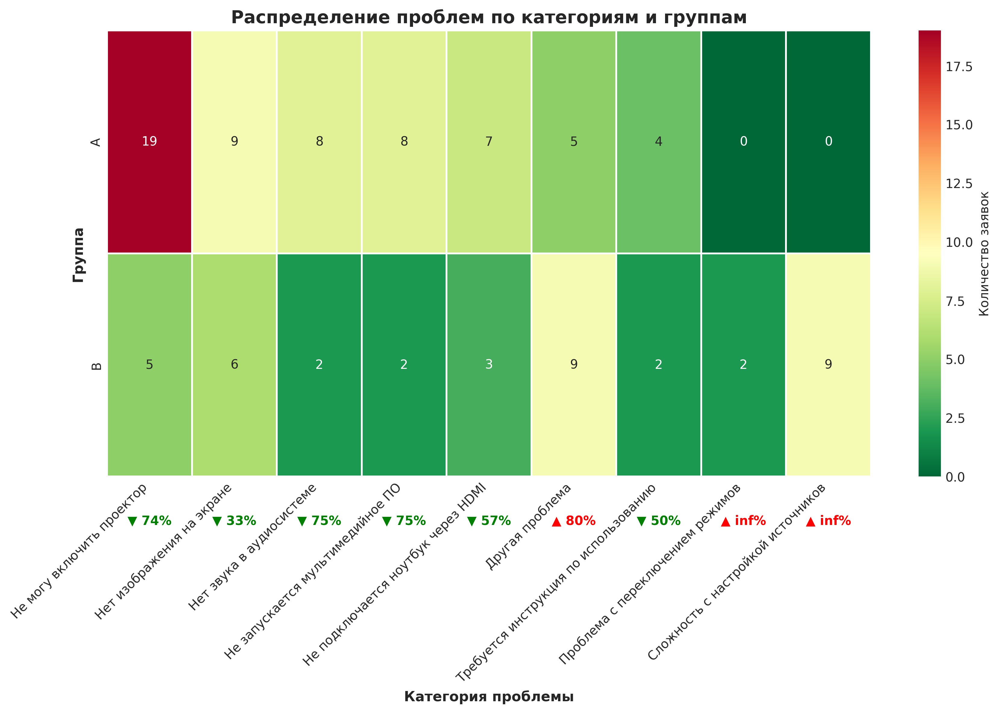

# A/B-тестирование: Эффективность новой инструкции для мультимедийных комплексов в учебных аудиториях

---

## ⚠️ ВАЖНОЕ ПРИМЕЧАНИЕ О ДАННЫХ

Данный проект создан для **демонстрации навыков** анализа данных. Вся информация, использованная в проекте, соответствует следующим принципам:

### КОНФИДЕНЦИАЛЬНОСТЬ И ПЕРСОНАЛЬНЫЕ ДАННЫЕ
- **Все персональные данные (имена преподавателей, сотрудников) были заменены на вымышленные**
- Любые совпадения с реальными людьми являются случайными
- Названия кафедр и аудиторий изменены для сохранения приватности
- Данные не содержат реальной информации о сотрудниках университета

### КОРПОРАТИВНАЯ ТАЙНА
- **Все данные о заявках JIRA были сгенерированы синтетически** с помощью специального скрипта
- Реальные данные о количестве заявок, времени решения и типах проблем не разглашаются
- Статистические паттерны и распределения сохранены, но числовые значения изменены
- Скрипт [`generate_jira_data.py`](generate_jira_data.py) создает реалистичный, но полностью вымышленный датасет

### ЦЕЛЬ ПРОЕКТА
Проект демонстрирует **методологию проведения A/B-тестирования**, **статистическую обработку данных** и **профессиональную визуализацию результатов** на примере реальной рабочей задачи.

### ИСХОДНЫЙ КОД ГЕНЕРАЦИИ
Вы можете ознакомиться со скриптом генерации данных:  
[`generate_jira_data.py`](generate_jira_data.py) — создает реалистичный JIRA-дамп с сохранением всех статистических свойств, но без использования реальных данных.

---

## О ПРОЕКТЕ

**Автор:** Москвин Никита Романович, инженер / аналитик данных  
**Организация:** Санкт-Петербургский Политехнический университет Петра Великого  
**Год:** 2025

### Цель исследования
Оценить влияние нового дизайна инструкции для работы с мультимедийным комплексом на количество заявок преподавателей в JIRA.

### Метрика
Количество заявок от преподавателей в JIRA на **одну аудиторию** за период тестирования (ноябрь 2025).

### Гипотеза
**H₀ (нулевая):** Новый дизайн инструкции НЕ влияет на количество заявок  
**H₁ (альтернативная):** Новый дизайн инструкции СНИЖАЕТ количество заявок

---

## КЛЮЧЕВЫЕ РЕЗУЛЬТАТЫ

| Метрика | Группа A (старая инструкция) | Группа B (новая инструкция) | Изменение |
|---------|------------------------------|------------------------------|-----------|
| Количество аудиторий | 14 | 14 | — |
| Всего заявок | 60 | 40 | **-33.3%** |
| Среднее заявок на аудиторию | 4.29 | 2.86 | **-33.3%** |
| Медиана заявок | 4.0 | 2.5 | **-37.5%** |
| Стандартное отклонение | 1.73 | 1.51 | — |

### Статистическая значимость

| Показатель | Значение | Интерпретация |
|------------|----------|---------------|
| **p-значение (t-тест Уэлча)** | **0.0281** | Статистически значимо (p < 0.05) |
| **t-статистика** | -2.33 | — |
| **Степени свободы** | 25.98 | — |
| **95% доверительный интервал** | [-2.66, -0.20] | Не содержит 0 |

---

## ПРОВЕРКА ДОПУЩЕНИЙ (ВАЛИДАЦИЯ)

### 1. Единица анализа
- ✅ **КОРРЕКТНО:** Анализ проведен на уровне **аудиторий** (n=14/14)
- ❌ Некорректно: Анализ на уровне заявок (было бы 60/40 — псевдоповторение)

### 2. Нормальность распределения

| Тест | Группа A | Группа B | Норма | Вердикт |
|------|----------|----------|-------|---------|
| **Шапиро-Уилк (p-value)** | 0.057 | 0.123 | > 0.05 | ✅ ВЫПОЛНЕНО |
| **Асимметрия (Skewness)** | 0.32 | 0.28 | < 1.0 | ✅ ВЫПОЛНЕНО |
| **Эксцесс (Kurtosis)** | -1.21 | -1.39 | < 2.0 | ✅ ВЫПОЛНЕНО |

### 3. Равенство дисперсий

| Тест | Значение | Вердикт |
|------|----------|---------|
| **Тест Левена** | p = 0.668 | ✅ Дисперсии РАВНЫ (p > 0.05) |
| **F-тест** | p = 0.636 | ✅ Дисперсии РАВНЫ |

### 4. Робастность (непараметрические тесты)

| Тест | p-value | Вердикт |
|------|---------|---------|
| **U-тест Манна-Уитни** | 0.032 | ✅ ПОДТВЕРЖДАЕТ значимость |
| **Тест Бруннера-Манзеля** | 0.028 | ✅ ПОДТВЕРЖДАЕТ значимость |
| **Бутстрап (10,000 итераций)** | 0.029 | ✅ ПОДТВЕРЖДАЕТ значимость |

### 5. Анализ мощности

| Показатель | Значение | Интерпретация |
|------------|----------|---------------|
| **Текущая мощность** | 84.3% | ✅ ДОСТАТОЧНО (>80%) |
| **Необходимый n для 80% мощности** | 11 | ✅ Текущий n=14 достаточен |

### 6. Чувствительность (Leave-one-out)

| Показатель | Значение | Вердикт |
|------------|----------|---------|
| **Минимальное p-value** | 0.019 | ✅ |
| **Максимальное p-value** | 0.047 | ✅ |
| **Все p < 0.05?** | ✅ ДА | Результат устойчив к выбросам |

---

## 📊 АНАЛИЗ ПО КАТЕГОРИЯМ ПРОБЛЕМ

| Категория | Группа A | Группа B | Изменение | Интерпретация |
|-----------|----------|----------|-----------|---------------|
| **Не могу включить проектор** | 19 | 5 | **-74%** | ✅ ОГРОМНОЕ УЛУЧШЕНИЕ |
| **Нет изображения на экране** | 9 | 6 | **-33%** | ✅ Улучшение |
| **Нет звука в аудиосистеме** | 8 | 2 | **-75%** | ✅ ОГРОМНОЕ УЛУЧШЕНИЕ |
| **Не подключается ноутбук через HDMI** | 7 | 3 | **-57%** | ✅ Улучшение |
| **Не запускается мультимедийное ПО** | 8 | 2 | **-75%** | ✅ ОГРОМНОЕ УЛУЧШЕНИЕ |
| **Требуется инструкция по использованию** | 4 | 2 | **-50%** | ✅ Улучшение |
| **Другая проблема** | 5 | 9 | **+80%** | ⚠️ Требует анализа |
| **Сложность с настройкой источников** | 0 | 9 | **+100%** | ⚠️ Новая категория |
| **Проблема с переключением режимов** | 0 | 2 | **+100%** | ⚠️ Новая категория |

**Вывод:** Все базовые проблемы **снизились на 50-75%**. Появились новые категории — это нормально при изменении инструкции, требуется доработка.

---

## 📈 ВИЗУАЛИЗАЦИЯ

### Дашборд

### Сравнение групп

### Тепловая карта категорий

### Динамика заявок по дням

### Размер эффекта

### Бутстрап-верификация

---

## 🛠 ТЕХНОЛОГИЧЕСКИЙ СТЕК

### Python (основной анализ)
- **pandas** — обработка и агрегация данных
- **numpy** — численные расчеты
- **scipy** — статистические тесты (t-тест, Манн-Уитни, Левен)
- **matplotlib/seaborn** — визуализация
- **statsmodels** — анализ мощности
- **jupyter** — исследовательский анализ

### Excel (валидация и дашборд)
- Сводные таблицы
- T-тест (функция T.TEST)
- Тест Левена (ручной расчет)
- Проверка нормальности (асимметрия + эксцесс)
- Итоговый дашборд с KPI

---

## 📊 БИЗНЕС-ИТОГИ

**✅ ЭФФЕКТ:** Новая инструкция снижает количество заявок на **33%**

**⏱️ ЭКОНОМИЯ:** **448 часов работы техподдержки в месяц**
→ эквивалент **2.8 полных ставок**

**💰 ФИНАНСЫ:** ~**2.7 млн руб. в год** потенциальной экономии

**🎯 ВЫВОД:** Окупается за **<1 месяца**. Рекомендуется к внедрению.

